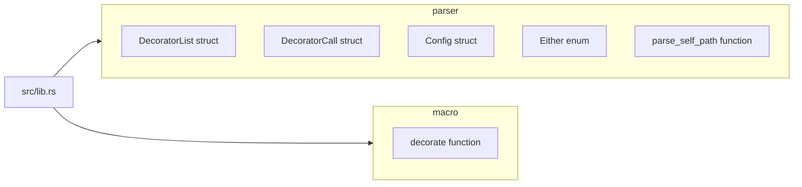
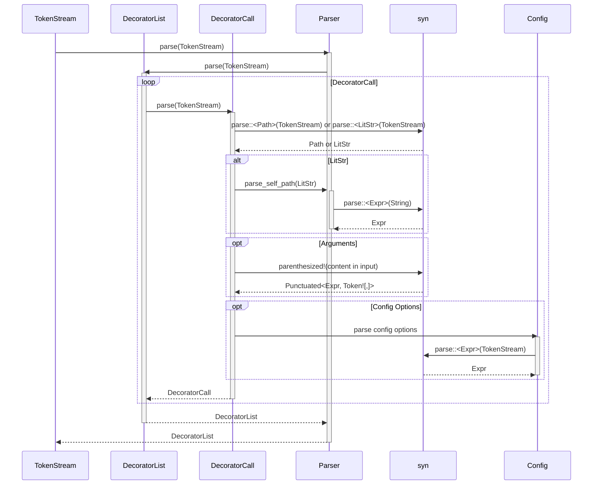
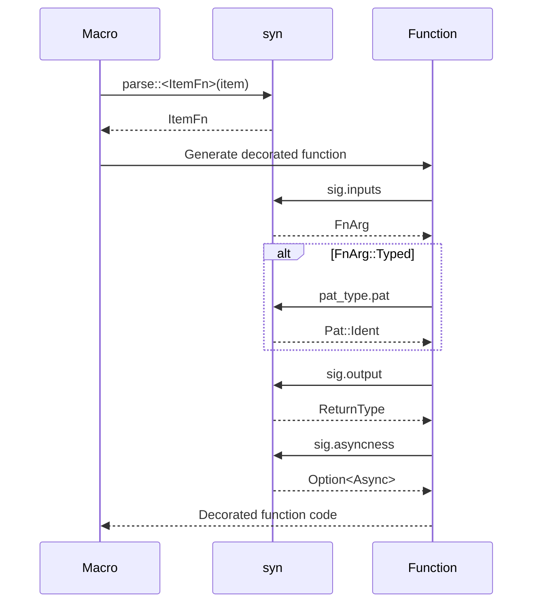

# Implementation Plan for Decorate Macro

## Library Goal

The primary goal of this library is to provide a flexible and extensible mechanism for decorating Rust functions with custom behavior. It aims to simplify the process of adding cross-cutting concerns like logging, validation, or authorization to functions without modifying their core logic.

## Target Audience

Rust developers who want to:

- Add common functionalities to multiple functions in a declarative way.
- Avoid repetitive code for cross-cutting concerns.
- Improve code readability and maintainability by separating core logic from auxiliary behavior.
- Create custom decorators tailored to their specific needs.

## Core Functionalities

- **Decorator Application:** Applying decorator functions to target functions using the `#[decorate]` attribute.
- **Decorator Composition:** Applying multiple decorators to a single function, with decorators executing in a defined order.
- **Decorator Arguments:** Passing arguments to decorator functions to customize their behavior.
- **Configuration Options:** Providing configuration options like `pre_code`, `post_code`, `transform_params`, and `transform_result` to further customize decorator behavior.
- **Async Support:** Supporting the decoration of asynchronous functions.
- **Struct Method Support:** Supporting the decoration of struct methods.
- **Self Path Support:** Allowing decorators to access the `self` parameter of a method.

## Public API

- `#[decorate(decorator_list)]`: Attribute macro to apply decorators to functions.
  - `decorator_list`: A comma-separated list of decorator calls.
  - `decorator_call`: Can be a path to a decorator function or a string literal representing a self path.
  - `decorator_call(arguments)`: Decorator call with arguments.
  - `pre = expression`: Configuration option to execute code before the decorated function.
  - `post = expression`: Configuration option to execute code after the decorated function.
  - `transform_params = path`: Configuration option to transform the parameters of the decorated function.
  - `transform_result = path`: Configuration option to transform the result of the decorated function.
- `Either<A, B>`: Enum to represent either a path or an expression.

## Module Structure

- `src/lib.rs`: Root module, containing the `decorate` attribute macro and re-exporting necessary types.
- `parser`: Module responsible for parsing the decorator list and individual decorator calls.
  - `DecoratorList`: Struct representing a comma-separated list of decorators.
  - `DecoratorCall`: Struct representing a single decorator call with optional arguments and configuration.
  - `Config`: Struct representing the configuration options for a decorator.
  - `Either`: Enum to represent either a path or an expression.
  - `parse_self_path`: Function to parse a self path from a string literal.
- `macro`: Module containing the implementation of the `decorate` attribute macro.
  - `decorate`: Function implementing the attribute macro logic.

## Data Structures and Algorithms

- `DecoratorList`: `Punctuated<DecoratorCall, Token![,]>` to store a list of decorators.
- `DecoratorCall`:
  - `path`: `Either<Path, syn::Expr>` representing the path to the decorator function.
  - `args`: `Option<Punctuated<Expr, Token![,]>>` representing the arguments to the decorator function.
  - `config`: `Option<Config>` representing the configuration options for the decorator.
- `Config`:
  - `pre_code`: `Option<syn::Expr>` representing the code to execute before the decorated function.
  - `post_code`: `Option<syn::Expr>` representing the code to execute after the decorated function.
  - `transform_params`: `Option<syn::Path>` representing the path to the function to transform the parameters of the decorated function.
  - `transform_result`: `Option<syn::Path>` representing the path to the function to transform the result of the decorated function.
- The macro will iterate through the `DecoratorList` in reverse order and generate nested function calls.

## Error Handling

- Use `syn::Error` to report errors during parsing and code generation.
- Provide informative error messages with suggestions for fixing the errors.
- Use `Result` to handle potential errors in the `parse_self_path` function.
- Handle cases where no decorator paths are provided.
- Handle cases where the decorated item is not a function.
- Handle cases where the decorator function does not exist or has an invalid signature.
- Handle cases where the arguments passed to the decorator function are invalid.
- Report errors as compile errors using `to_compile_error()`.

## Logging

- Use the `log` crate for logging.
- Provide different logging levels for different types of messages (e.g., debug, info, warn, error).
- Log the decorator paths, arguments, and configuration options.
- Log any errors that occur during parsing or code generation.
- Consider adding a feature flag to enable/disable logging.

## Testing

- **Unit Tests:** Test individual functions and modules in isolation.
  - Test the `parse_self_path` function with different inputs.
  - Test the `DecoratorList` and `DecoratorCall` parsing with different inputs.
  - Test the code generation logic with different decorator configurations.
- **Integration Tests:** Test the interaction between different modules and the overall functionality of the library.
  - Test the `#[decorate]` attribute macro with different decorator functions and arguments.
  - Test the `#[decorate]` attribute macro with different function signatures (e.g., async, generic).
  - Test the `#[decorate]` attribute macro with different configuration options.
- **Compile Tests:** Use `trybuild` to ensure that the macro generates correct code and reports errors correctly.
  - Create tests that should compile successfully.
  - Create tests that should fail to compile with specific error messages.

## Documentation

- Provide inline documentation for all public API elements (functions, structs, enums, traits).
- Generate documentation using `cargo doc`.
- Include examples in the documentation to demonstrate how to use the library.
- Write a README file with a high-level overview of the library and its features.
- Consider creating a website with more detailed documentation and examples.

## Performance Considerations

- The macro generates code at compile time, so the performance impact on runtime should be minimal.
- Avoid unnecessary allocations and copies in the generated code.
- Consider using `#[inline]` to encourage the compiler to inline the generated code.
- Benchmark the generated code to identify potential performance bottlenecks.

## Security Aspects

- The macro itself does not introduce any security vulnerabilities.
- However, the decorator functions that are applied to the decorated functions may introduce security vulnerabilities.
- Ensure that the decorator functions are properly validated and sanitized to prevent any potential security issues.
- Be careful when using the `pre_code` and `post_code` configuration options, as they allow arbitrary code to be executed.

## External Dependencies

- `proc_macro`: For creating the attribute macro.
- `quote`: For generating Rust code.
- `syn`: For parsing Rust code.
- `log`: For logging.
- `trybuild`: For compile tests.

## Parsing Logic

The parsing logic is responsible for taking the input `TokenStream` representing the decorator list and converting it into a structured representation that can be used by the `decorate` macro. The parsing process involves several steps:

1.  **Tokenization:** The input `TokenStream` is tokenized into a sequence of tokens.
2.  **Parsing DecoratorList:** The `DecoratorList` struct is parsed from the token stream. This involves parsing a comma-separated list of `DecoratorCall` structs.
3.  **Parsing DecoratorCall:** The `DecoratorCall` struct is parsed from the token stream. This involves parsing the decorator path, optional arguments, and optional configuration options.
4.  **Parsing Decorator Path:** The decorator path can be either a path to a decorator function or a string literal representing a self path. If it is a string literal, it is parsed using the `parse_self_path` function.
5.  **Parsing Arguments:** If the decorator call has arguments, they are parsed as a comma-separated list of expressions.
6.  **Parsing Configuration Options:** If the decorator call has configuration options, they are parsed as a sequence of key-value pairs. The supported configuration options are `pre`, `post`, `transform_params`, and `transform_result`.

## Handling Different Function Signatures

The `decorate` macro needs to handle different function signatures, including:

- Functions with no arguments.
- Functions with arguments.
- Functions with generic arguments.
- Functions with `self` as an argument (methods).
- Async functions.
- Functions with different return types.

The macro achieves this by:

1.  **Parsing the Function Signature:** The macro parses the function signature using `syn::ItemFn`. This provides access to the function's visibility, signature (including arguments and return type), and body.
2.  **Generating the Decorated Function:** The macro generates a new function with the same signature as the original function. The body of the new function is constructed by wrapping the original function body with the decorator functions.
3.  **Handling Arguments:** The macro passes the arguments of the original function to the decorator functions. If the decorator function takes arguments, the macro passes those arguments as well.
4.  **Handling Generic Arguments:** The macro preserves the generic arguments of the original function in the generated function.
5.  **Handling `self`:** When decorating methods, the macro correctly handles the `self` argument.
6.  **Handling Async Functions:** The macro detects if the function is async and generates the appropriate code to await the result of the decorated function.
7.  **Handling Return Types:** The macro preserves the return type of the original function in the generated function.

